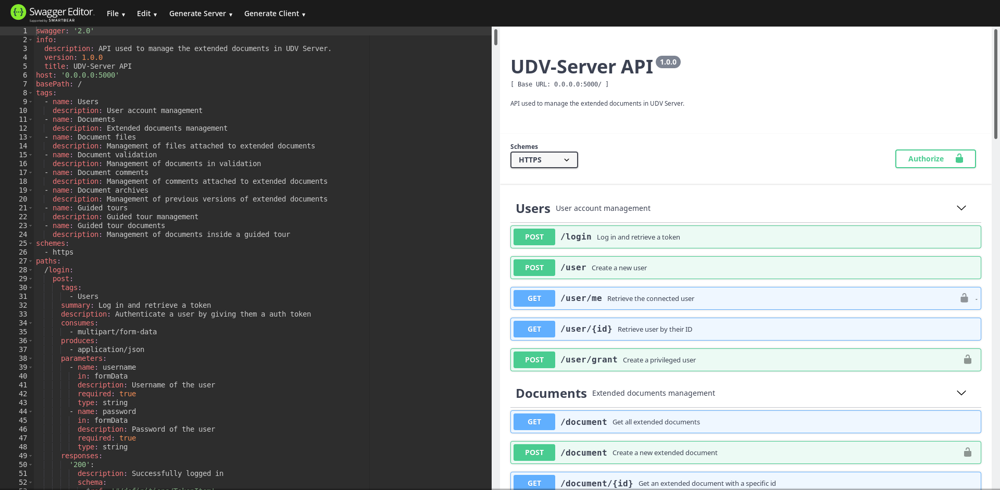

# API Documentation

Instead of the previous huge unreadable markdown file, we decided to
use the OpenAPI 2.0 standard to make a clear API documentation. It is
a standardized format described on their
[Github project](https://github.com/OAI/OpenAPI-Specification/blob/master/versions/2.0.md).

Thanks to the Swagger tool suit, working with this document is quite practical
: it's readable, and we can easily update it through tools like the
Swagger editor or Swagger hub.

## File

The swagger file is located under `doc/OpenAPI2.0/swagger.json`. The
specification of OpenAPI recommends two formats for an API descriptor
file: JSON and YAML. We decided to use JSON but both formats are
interchangeable.

## Accessing the file

You can easily read the file by going into the [Swagger Editor](https://editor.swagger.io/)
and importing the file e.g. with

```bash
cd doc/OpenAPI2
docker run -d -p 8080:8080 -v $(pwd):/tmp -e SWAGGER_FILE=/tmp/swagger.json swaggerapi/swagger-editor
```

and web-browse `http://localhost:8080`.

You can then modify the `swagger.json` by using the YAML editor.



You can also use the [Swagger Hub](https://app.swaggerhub.com/), which is
a more advanded tool, but you'll need to create an account (or you can
sign in with a Github Account).
