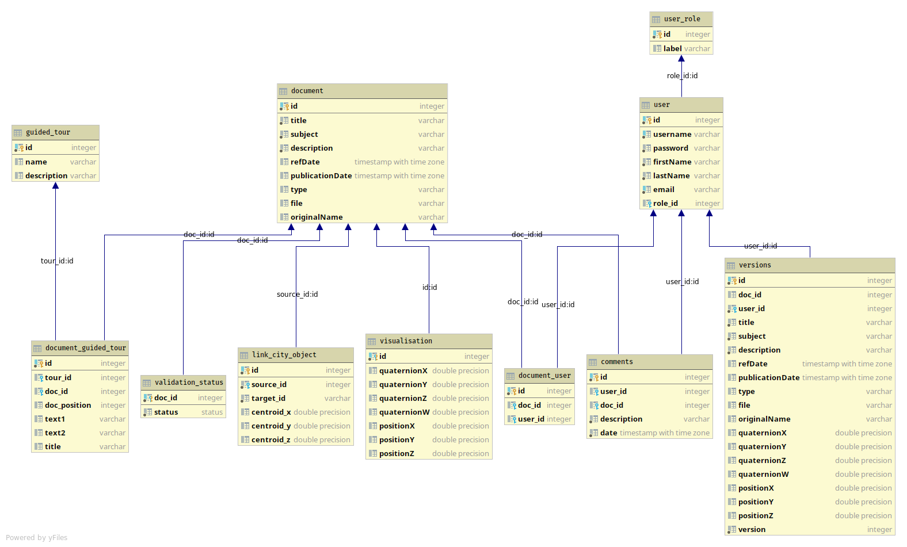

# Spatial Multimedia DB application design notes

## General description

In this section, the various entities managed by the API will be described.

- A **Document** represents a multimedia asset, coupled with some metadata. These metadata consist of a few attributes (title, description, etc.). Additional pieces of information are represented by other entities in relationship with documents :
  - The **Visualization** class contains 3D coordinates and orientation to place the document in the scene. The goal is for the document to be "projected" in the 3D objects of the scene.
  - The **ValidationStatus** represents the state of the document concerning the validation process. Its value can either be "Validated" or "In validation". Whe, a contributor makes a suggestion, the document is considered "In validation" and does not appear on the full list of documents. Once a moderator or an administrator accepts it, it becomes "Validated".
- The class **GuidedTour** represent a sequence of documents, which can be displayed in order with additional text in the web client. To represent the *many to many* relationship with the **Document** class, another entity is created, called **DocumentGuidedTour**.
- User accounts are represented by the **User** class. A user has a few pieces of information (a username, a name, etc.) and a role, represented by the **UserRole** class. The role defines the permissions of a user : as of today, 3 different roles are defined (contributor - a normal user, moderator - a user that can view and validate submissions, and admin - with all permissions).
  - In order to keep the user management separate from the documents, the relationship is represented by a dedicated class called **DocumentUser**. A document has only one user, who represents its creator (on the website).
  - Another class is used to represent the comments of a document : it bears the name **Comment**. A comment has one author and is bound to one document.
- Consecutive versions of documents are saved in the **Version** entity. This class has all attributes of the document and the associated visualization.
- The link between documents and city objects is represented by the **LinkCityObject** class. In the future, more types of links could be implemented by adding new "Link<Object>" classes.

You can find below the actual database diagram currently used in the application.

This diagram was generated by the [yFiles](https://www.yworks.com/products/yfiles) plugin of the [PyCharm](https://www.jetbrains.com/pycharm/) IDE, **Professional edition** (only possible with this edition).

To renegerate it, follow these instruction:
  * [Install this API](INSTALL.md)
  * Open pycharm
  * In the pycharm settings, under *Tools*, choose *Diagrams* and check the *SQLAlchemy Model dependency diagram* and the *Fields* checkboxes (assert this step is really needed...)
  * Connect to the database in pycharm:
    * Open the database tab from the right side on pycharm
    * Click on the *+*, choose *Data Source*, *PostgreSQL*
    * In the SPATIAL_MULTIMEDIA_DB_HOST, put the IP address of your docker (you can find it by running the following command in a terminal: `docker inspect --format='{{range .NetworkSettings.Networks}}{{.IPAddress}}{{end}}' Spatial-Multimedia-postgres`)
    *  The other information match the values in the `.env` file (SPATIAL_MULTIMEDIA_DB_USER = postgres, SPATIAL_MULTIMEDIA_DB_PASSWORD = password, SPATIAL_MULTIMEDIA_DB_PORT = 5432 and Database = extendedDoc)
    * Hit Test Connection and then Ok
   * Expand: the database imported in pycharm, extendedDoc and schemas
   * Right click on `public`, choose `Diagrams` and `show visualization`.

The sources of the Spatial Multimedia DB application can be found on the [UDV sever git repository](.).

## MVC Architecture

The application uses an [Model View Controller (MVC)](https://en.wikipedia.org/wiki/Model%E2%80%93view%E2%80%93controller) architecture that is described in this chapter.

### Model (entity)

The model consist of the class definitions for the diagram shown above. These are located in the [entities](../entities/) folder. They also contain some logic to interact with the persistence unit (the database), in order to create, update or delete themselves.

Some entities have special behaviour : the document entity for example, creates a new "version" entity at each update.

### Controller

The controller is used to interact with the entities. It can realize all the CRUD (Create, Read, Update, Delete) operations.

### View

The view of Spatial Multimedia DB City consist of the definition of the different routes to access the resources. A route is simply a path specified in the URL to request specific resources or perform actions. For example, the request `GET <server-url>/document` returns a JSON list of all documents. The API is designed by following the [REST architectural style](https://en.wikipedia.org/wiki/Representational_state_transfer) and you can find the documentations for all routes in the [documentation file](API-Documentation.md).

The view is defined in the [api](../api/) folder, and the route themselves are all located in the [web_api.py](../api/web_api.py) file.

## ORM (Object Relational Mapping)

### Description
ORM is a way to create a strong interaction between objects that should be persisted and a DataBase (DB) : when an object is modified, the modification can be easily persisted to the DB without the need to write any SQL request.
Such a feature can reduce the complexity of the code since it offers to increase its abstraction level by making it independent from the particular technology of the chosen concrete DB (postgreSQL, Oracle, MySQL...).

### How to?
**How can we share inheritance or foreign key notion between an object and a DB ?**

Although the implementation is not required to write sql requests, it still needs to indicate the relationship between the DB and the object directly in their python code.
For that we use the [sqlalchemy library](htps://www.sqlalchemy.org) that in turn uses the [psycorpg2](http://initd.org/psycopg/docs/) (as an adapter/connector) to communicate with the PostgreSQL DataBase.

The [entities/README.md summary](../entities/README.md) documents what is used from SQLAlchemy.
However a lot of things are not broached and can be found the [SQLAlchemy tutorial](http://docs.sqlalchemy.org/en/latest/orm/tutorial.html).

## Web Application

### Flask

[flask](http://flask.pocoo.org/docs/1.0/) is a micro web framework developped in python. This framework allows us to interpret HTTP request (mainly GET and POST methods) and send appropriate response to the client.
Some complementary information (concerning the Flask part of the application) is available in 
the [api folder](../api/README.md).
Moreover, you can find a tutorial [here](http://flask.pocoo.org/docs/1.0/quickstart/#a-minimal-application).

## Other directories

**log**
This directory collects some information of what happens during the execution of the application :
- **info.log** : information about the global application execution
- **sqlalchemy.log** : operations between the DB and python

**persistence_unit**
This directory contains some methods to facilitate the interaction between the DB and the python objects and reduce lines of code when persisting objects.

**test**
The test directory is used to make tests, in order to assert that the application works well.

**log**
Defines the configuration of the logger of the application.

**db_config.py**
The configuration of application is realized through environment variables (defined in [.env file](../.env)).

The .env file makes the following definitions :

```
SPATIAL_MULTIMEDIA_ORDBMS=<type of DB>
SPATIAL_MULTIMEDIA_DB_USER=<username to use the DB>
SPATIAL_MULTIMEDIA_DB_PASSWORD=<password of the user>
SPATIAL_MULTIMEDIA_DB_HOST=<server hosting the DB>
SPATIAL_MULTIMEDIA_DB_PORT=<port of the server>
SPATIAL_MULTIMEDIA_DB_NAME=<name of the database>
```

## Further documentations

- **How to use the API**
You can find [here](API-Documentation.md) the documentation of the API which describes mainly the routes to commuicate with the server.

- **Installation**
To install the application both on UNIX and Windows, go to this [file](INSTALL.md).

- **Decorator**
We use several times decortors in the application, in order to simplify the code and make it more readable. However it is not a very obvious thing to understand, that is why we made a [tutorial](Decorators.md) to understand what it is and how we use them.

- **Diagram**
The diagram were mostly made with [Visual Paradigm](https://visual-paradigm.com/), for further information on how you can modify them, go [there](Class-diagrams.md).
