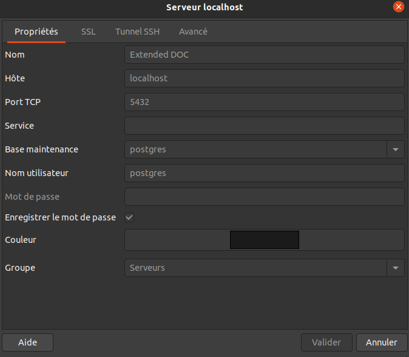
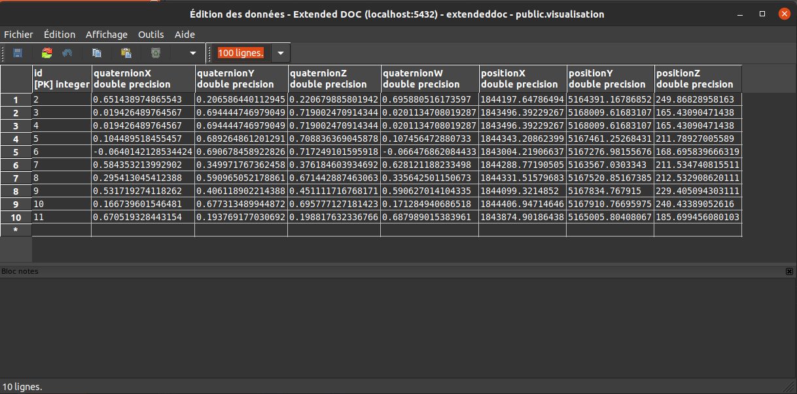
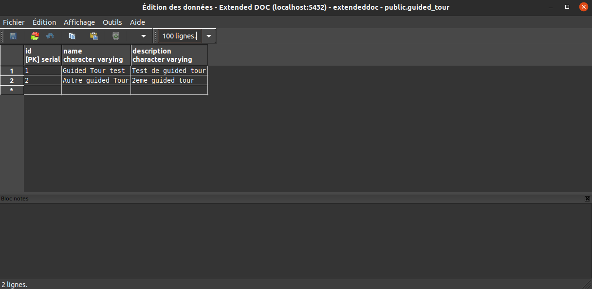
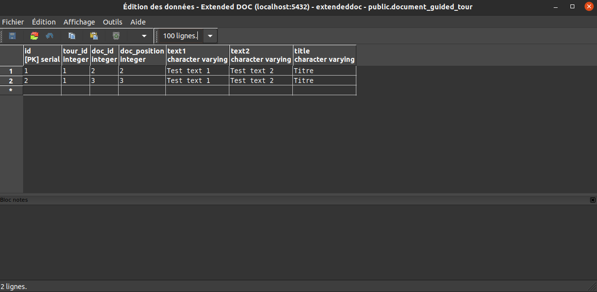

# Guided Tour Construction
⚠️⚠️ YOU NEED TO HAVE EXTENDED DOCUMENT BEFORE TO CREATE A GUIDED TOUR ⚠️⚠️
## Setup
 * First of all you need to launch [Spatial Multimedia database](../../INSTALL.md)
 * Install pgadmin on your computer
   ````
   sudo sh -c 'echo "deb http://apt.postgresql.org/pub/repos/apt/ $(lsb_release -cs)-pgdg main" >> /etc/apt/sources.list.d/pgdg.list'

   sudo apt install wget ca-certificates

   wget --quiet -O - https://www.postgresql.org/media/keys/ACCC4CF8.asc | sudo apt-key add

   sudo apt update

   sudo apt install pgadmin4
   ````
* Connect the Database with pgadmin with the configuration of the Spatial Multimedia DB in the [.env](../.env)


## Configure a guided tour
In the pgadmin server your got three important table : 
  - **visualisation** is the coordinate (position and rotation) of the document in UD-Viz scene,
  
  
  
  - **guided_tour** is the information of differents guided created and 
  
  
  
  - **document_guided_tour** is to link document and guided tour.
  
   

* **First step** : Create a guided_tour table with an id, name and description.
* Then you need to link a guided_tour id and visualisation id to add the document to the correct guided tour.

## Possible axis of improvements
* An HUD in UD-Viz to create easier a Guided Tour
 
